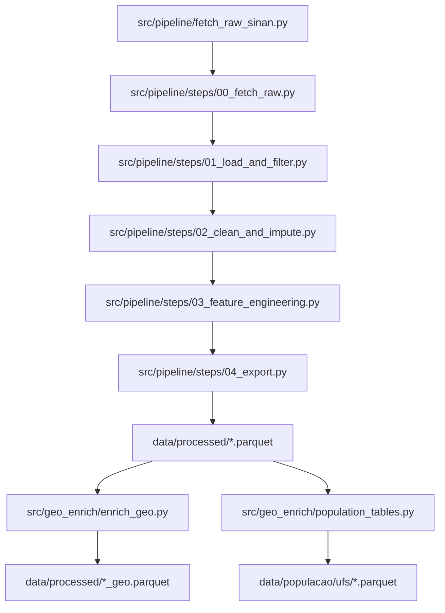

# Projeto Caramujo - Esquistossomose

Analise exploratória e pipeline de preprocessamento de dados de esquistossomose, com notebooks e dados auxiliares.

## Estrutura do `src/`

A pasta `src/` concentra a lógica executável do projeto. Ela foi dividida em dois blocos:

- `src/pipeline/`: download, limpeza, imputação, engenharia de features e exportacao do dataset.
- `src/geo_enrich/`: enriquecimento geográfico e tabelas auxiliares de população.

A ideia central do código é modular e incremental. Cada etapa recebe um `DataFrame`, aplica uma transformação bem delimitada, devolve o `DataFrame` atualizado e um bloco pequeno de métricas da propria etapa. Isso deixa o fluxo mais facil de auditar, testar e reutilizar em notebooks.



### Padroes usados no codigo

- `src/pipeline/config.py` centraliza caminhos padrao, colunas descartadas, colunas de data, codigos ignorados e faixas de validacao.
- Cada etapa de `src/pipeline/steps/` devolve um `@dataclass` com as métricas da propria etapa.
- `src/pipeline/run_pipeline.py` faz a orquestracao e carrega dinamicamente os arquivos `00_...` a `04_...`, porque os nomes numéricos não funcionam bem como imports diretos.
- `src/geo_enrich/` é um segundo fluxo, separado do preprocessamento, que atua sobre o arquivo já processado.

### Arquivos em `src/pipeline/`

| Arquivo | Papel | Observacoes |
| --- | --- | --- |
| [src/pipeline/__init__.py](src/pipeline/__init__.py) | Marca o pacote `pipeline`. | Nao contém logica de processamento; serve para organizar o módulo. |
| [src/pipeline/config.py](src/pipeline/config.py) | Define a configuração central do pipeline. | Reune constantes de descarte, datas, códigos ignorados, limites de idade e presets como `immediate-only`. |
| [src/pipeline/fetch_raw_sinan.py](src/pipeline/fetch_raw_sinan.py) | CLI dedicada ao download bruto via `pysus`. | Reaproveita a ideia do Step 00; na prática, o fluxo mais integrado e o `run_pipeline.py --download-raw`. |
| [src/pipeline/run_pipeline.py](src/pipeline/run_pipeline.py) | Ponto de entrada principal do pipeline. | Faz parse dos argumentos da linha de comando, monta `PipelineConfig`, executa os steps e imprime as metricas. |
| [src/pipeline/steps/__init__.py](src/pipeline/steps/__init__.py) | Marca o subpacote de steps. | Ajuda a organizar as etapas numeradas do pipeline. |
| [src/pipeline/steps/00_fetch_raw.py](src/pipeline/steps/00_fetch_raw.py) | Baixa os arquivos do SINAN via `pysus` e salva o parquet bruto. | E o Step 00, usado quando o comando inclui `--download-raw`. |
| [src/pipeline/steps/01_load_and_filter.py](src/pipeline/steps/01_load_and_filter.py) | Carrega o bruto, aplica filtros iniciais e remove colunas do descarte imediato. | Faz o filtro de positivos, o filtro do alvo e o descarte das colunas listadas em `descarte_imediato.txt`. |
| [src/pipeline/steps/02_clean_and_impute.py](src/pipeline/steps/02_clean_and_impute.py) | Limpa tipos, padroniza nulos, aplica regras de dominio e imputação. | Converte datas, normaliza `CS_ESCOL_N`, trata idade/ano de nascimento/`AN_QUANT`, mapeia codigos ignorados e remove outliers por IQR. |
| [src/pipeline/steps/03_feature_engineering.py](src/pipeline/steps/03_feature_engineering.py) | Cria features derivadas para modelagem. | Gera atrasos temporais e idade aproximada no evento; depois pode descartar colunas antigas com base na config. |
| [src/pipeline/steps/04_export.py](src/pipeline/steps/04_export.py) | Exporta o dataset final. | Persiste o parquet processado no caminho definido em `PipelineConfig`. |

### Arquivos em `src/geo_enrich/`

| Arquivo | Papel | Observacoes |
| --- | --- | --- |
| [src/geo_enrich/__init__.py](src/geo_enrich/__init__.py) | Marca o pacote `geo_enrich`. | Não possui lógica; apenas organiza o módulo. |
| [src/geo_enrich/enrich_geo.py](src/geo_enrich/enrich_geo.py) | Enriquecimento geográfico do parquet processado. | Cruza `ID_MUNICIP` com a base do `geobr` para adicionar nome do município, UF e centroides. |
| [src/geo_enrich/population_tables.py](src/geo_enrich/population_tables.py) | Gera tabelas de populacao por ano usando IBGE/SIDRA. | Usa os anos presentes em `DT_NOTIFIC` ou a lista informada na CLI e salva as tabelas por UF. |

### Como os modulos se encaixam

1. O pipeline comeca em `run_pipeline.py`, que recebe os argumentos da linha de comando e monta um `PipelineConfig`.
2. Se `--download-raw` for usado, o Step 00 baixa os arquivos do SINAN e cria o parquet bruto local.
3. O Step 01 carrega o bruto, aplica filtros de negócio e remove as colunas do descarte imediato.
4. O Step 02 limpa o dataset, converte datas, trata nulos, aplica regras de dominio e remove outliers numericos.
5. O Step 03 cria as features derivadas e, se configurado, remove colunas antigas apos a engenharia de atributos.
6. O Step 04 exporta o parquet final para `data/processed/`.
7. Depois disso, o fluxo geografico pode ser aplicado com `geo_enrich/enrich_geo.py`, e as tabelas de populacao podem ser geradas com `geo_enrich/population_tables.py`.

## Pipeline de preprocessamento

### Arquitetura

- Entrada: `data/sinan_esqu_raw.parquet`
- Saida: `data/processed/sinan_esqu_processed.parquet`
- Orquestracao: `src/pipeline/run_pipeline.py`
- Etapas:
	- `00_fetch_raw.py`
	- `01_load_and_filter.py`
	- `02_clean_and_impute.py`
	- `03_feature_engineering.py`
	- `04_export.py`

### Decisões (em construção)

- Descarte imediato: regras baseadas em `anotacoes/descarte_imediato.txt` (sera formalizado no pipeline).
- O arquivo de descarte imediato e a fonte de verdade do preset `immediate-only`; `ID_AGRAVP` no texto corresponde a `ID_AGRAVO` no bruto atual.
- Nulos: mediana para numericos; moda para categóricos; remoção condicional de linhas criticas.
- Feature engineering: idade, atrasos temporais e datas derivadas.
- Outliers: filtro IQR conservador (1.5) para numericos e pos-features temporais.
- Escolaridade: `CS_ESCOL_N` normalizada para 0-10 antes do mapeamento de ignorados.

## Como executar (pipeline)

Requisitos: Python 3.10+.

```bash
python -m venv .venv
source .venv/bin/activate
pip install -r requirements.txt
export PYTHONPATH=src
python -m pipeline.run_pipeline
```

## Tutorial completo do pipeline (src)

### 0) Baixar dados via pysus (opcional)

Use quando quiser baixar o bruto direto do SINAN e salvar em `data/sinan_esqu_raw.parquet`.

```bash
export PYTHONPATH=src
python -m pipeline.run_pipeline --download-raw
```

Para baixar apenas o bruto, sem rodar o restante do pipeline:

```bash
export PYTHONPATH=src
python -m pipeline.fetch_raw_sinan
```

### 1) Preparar dados de entrada

- O arquivo bruto esperado por padrao e `data/sinan_esqu_raw.parquet`.
- Se quiser usar outro caminho/arquivo, utilize `--input` (ver exemplos abaixo).

### 2) Executar com configuração padrão

```bash
export PYTHONPATH=src
python -m pipeline.run_pipeline
```

Saida padrao: `data/processed/sinan_esqu_processed.parquet`.
Durante a execucao, o pipeline imprime contagens por etapa.

Para gerar a base voltada ao eixo de ML nao supervisionado, use o perfil `unsupervised-ml`. Nesse modo, o pipeline nao filtra por `EVOLUCAO`, remove apenas registros com `AN_QUALI = 2`, preserva `AN_QUALI = 3` e valores em branco como ausentes, e grava por padrao em `data/processed/sinan_esqu_unsup.parquet`.

### 3) Principais parametros via CLI

- `--input`: caminho do parquet bruto (default: `data/sinan_esqu_raw.parquet`).
- `--output`: caminho do parquet processado (default depende do `--cohort-profile` escolhido).
- `--cohort-profile`: escolhe o perfil da base. `supervised` mantem o fluxo atual; `unsupervised-ml` cria a base sem filtro por evolucao e com descarte apenas de `AN_QUALI = 2` (exame negativo para esquistossomose).
- `--download-raw`: baixa dados via pysus antes de rodar o pipeline.
- `--dis-code`: codigos da doenca separados por virgula (default: `ESQU`).
- `--no-positive-filter`: desativa o filtro de casos positivos. Por padrao, filtra `AN_QUALI == "1"`.
- `--positive-column`: coluna usada no filtro de positivos (default: `AN_QUALI`).
- `--positive-value`: valor considerado positivo (default: `1`).
- `--no-target-filter`: desativa o filtro baseado no alvo (`EVOLUCAO`).
	- Quando desativado, o alvo nao e normalizado nem filtrado por codigos invalidos.
	- Os valores em `target_drop_values` (ex.: `"4"`) nao sao removidos.
	- A coluna alvo pode entrar na imputacao (mediana/moda) caso esteja com NA.
- `--no-drop-after-features`: mantem colunas originais apos o feature engineering.
- `--drop-profile`: escolhe um preset de descarte de colunas. O preset `immediate-only` remove apenas as colunas do `descarte_imediato.txt` e desativa o descarte posterior.

No perfil `unsupervised-ml`, os filtros de coorte sao diferentes do fluxo supervisionado: `EVOLUCAO` nao e usado para remover linhas, `AN_QUALI = 2` e excluido da base e `EVOLUCAO` / `AN_QUALI` ficam fora da imputacao.

Se precisar mudar regras fixas (colunas descartadas, datas, codigos ignorados,
faixas de idade, etc.), edite `src/pipeline/config.py`.

### 4) Exemplos de uso

```bash
# usar outro arquivo de entrada e saida
PYTHONPATH=src python -m pipeline.run_pipeline \
	--input data/sinan_esqu.csv \
	--output data/processed/sinan_esqu_custom.parquet

# baixar bruto via pysus e rodar o pipeline
PYTHONPATH=src python -m pipeline.run_pipeline --download-raw

# baixar bruto com codigo customizado
PYTHONPATH=src python -m pipeline.run_pipeline --download-raw --dis-code ESQU

# executar sem filtro de casos positivos
PYTHONPATH=src python -m pipeline.run_pipeline --no-positive-filter

# desativar filtro do alvo (EVOLUCAO)
PYTHONPATH=src python -m pipeline.run_pipeline --no-target-filter

# usar apenas o descarte_imediato.txt como regra de descarte de colunas
PYTHONPATH=src python -m pipeline.run_pipeline --drop-profile immediate-only

# gerar a base para ML nao supervisionado
PYTHONPATH=src python -m pipeline.run_pipeline --cohort-profile unsupervised-ml

# trocar coluna e valor do filtro de positivos
PYTHONPATH=src python -m pipeline.run_pipeline \
	--positive-column AN_QUALI \
	--positive-value 1

# manter colunas originais apos feature engineering
PYTHONPATH=src python -m pipeline.run_pipeline --no-drop-after-features

# gerar processado com DT_NOTIFIC
PYTHONPATH=src python -m pipeline.run_pipeline \
	--output data/processed/sinan_esq_processed_with_dt_notific.parquet
```

## Enriquecimento geografico (geo_enrich)

Script: [src/geo_enrich/enrich_geo.py](src/geo_enrich/enrich_geo.py)

Como rodar:
```bash
PYTHONPATH=src python -m geo_enrich.enrich_geo \
	--input data/processed/sinan_esq_processed_with_dt_notific.parquet \
	--output data/processed/sinan_esq_processed_with_dt_notific_geo.parquet
```

## Notebooks

- [notebooks/AED_Esquistossomose_Final.ipynb](notebooks/AED_Esquistossomose_Final.ipynb): analise exploratoria final.
- [notebooks/esqu_preprocess_FINAL.ipynb](notebooks/esqu_preprocess_FINAL.ipynb): preprocessamento dos dados.
- [notebooks/analise_geoespacial/EDA_esq_processed.ipynb](notebooks/analise_geoespacial/EDA_esq_processed.ipynb): EDA da base processada com DT_NOTIFIC.
- [notebooks/analise_geoespacial/validacao_e_analise_temporal_basica](notebooks/analise_geoespacial/validacao_e_analise_temporal_basica): validacao e analise temporal basica.

## Documentacao

- `anotacoes/dicionario.md`: dicionario de variaveis e codigos.

## Dados

Somente `data/sinan_esqu_raw.parquet` deve ser versionado. Os demais arquivos em `data/` sao considerados locais.

Se algum arquivo de `data/` ja estiver no Git, remova-o do indice antes de publicar:

```bash
git rm --cached data/arquivo_que_nao_deve_subir
```

## Licenca

MIT. Veja `LICENSE`.
