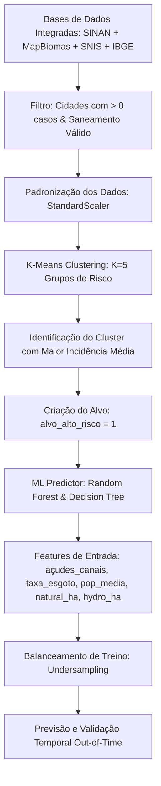

# Contexto do Repositório: Projeto Caramujo - Esquistossomose

Este documento fornece um mapeamento completo do repositório **Projeto-Caramujo** para orientar o desenvolvimento de uma aplicação interativa em **Streamlit**. Ele sintetiza a arquitetura dos dados, os pipelines de pré-processamento, as descobertas das análises geoespaciais e a especificação técnica para o modelo preditivo socioambiental de Machine Learning.

---

## 1. Visão Geral do Projeto

A esquistossomose (conhecida popularmente como "barriga d'água" ou "doença do caramujo") é uma doença parasitária transmitida através da exposição a coleções de água doce que abrigam caramujos hospedeiros infectados por larvas do verme *Schistosoma mansoni*. A transmissão está intimamente ligada a vulnerabilidades socioambientais (infraestrutura sanitária inadequada) e à presença de coleções hídricas onde as populações locais realizam atividades de subsistência, lazer ou trabalho doméstico.

### O Objetivo Central do Estudo
O projeto investiga a seguinte pergunta:
> **Quais características ambientais e de infraestrutura urbana determinam se um município se tornará um polo de transmissão (foco de alto risco) para a esquistossomose no Brasil?**

Para responder a isso, o projeto integra dados de:
1. **Saúde Pública (SINAN):** Casos notificados e confirmados da doença.
2. **Uso do Solo e Satélite (MapBiomas):** Extensão de corpos d'água naturais e artificiais.
3. **Dados Censitários (IBGE/SIDRA):** População para cálculo de taxas de incidência.
4. **Saneamento Básico (SNIS):** Coleta e tratamento de esgoto doméstico.

---

## 2. Estrutura do Repositório

O projeto é modular e está organizado nas seguintes pastas principais:

- `src/`: Lógica executável em pacotes Python.
  - [src/pipeline/](file:///home/gabyl/projetos/Projeto-Caramujo/src/pipeline): Código de ingestão e pré-processamento (limpeza, imputação de nulos, feature engineering e exportação do SINAN).
  - [src/geo_enrich/](file:///home/gabyl/projetos/Projeto-Caramujo/src/geo_enrich): Códigos para adicionar dados de municípios e UFs usando o `geobr` e geração de tabelas de população via IBGE/SIDRA.
- `data/`: Armazenamento de dados locais (brutos e processados).
  - `sinan_esqu_raw.parquet`: Dataset bruto baixado do SINAN.
  - `processed/`:
    - `sinan_esqu_processed.parquet`: Base tratada (para ML tradicional/supervisionado).
    - `sinan_esq_processed_with_dt_notific_geo.parquet`: Base enriquecida geograficamente (contém dados temporais e geográficos como UF, município e coordenadas).
- `notebooks/`: Análises exploratórias.
  - [notebooks/analise_geoespacial/](file:///home/gabyl/projetos/Projeto-Caramujo/notebooks/analise_geoespacial): Diretório principal contendo as investigações geoespaciais e o modelo preditivo que servirá de base para o Streamlit.
- `anotacoes/`: Documentação de suporte.
  - [anotacoes/dicionario.md](file:///home/gabyl/projetos/Projeto-Caramujo/anotacoes/dicionario.md): Dicionário detalhado das variáveis originais do SINAN (como `AN_QUALI`, `EVOLUCAO`, `FORMA`, `TRATAM`, etc.).
  - [anotacoes/detalhes_de_enriquecimento_geografico.md](file:///home/gabyl/projetos/Projeto-Caramujo/anotacoes/detalhes_de_enriquecimento_geografico.md): Scripts de referência para manipulação espacial e plotagem com `geopandas` e `geobr`.

---

## 3. Fontes de Dados e Engenharia de Atributos

A análise geoespacial socioambiental realiza o cruzamento de quatro grandes bases. Para o agente Streamlit, é fundamental entender como esses dados foram integrados e a lógica por trás de cada atributo:

### A. Saúde (SINAN)
- **Filtro de Confirmação:** O pipeline filtra apenas os registros em que o exame de fezes foi positivo, identificado pela coluna `AN_QUALI == 1` (exame Kato-Katz).c
- **Métricas:** Número de asos anuais agregados por município (`code_muni`, 6 dígitos).

### B. Hidrografia por Satélite (MapBiomas)
Os dados brutos fornecem a área em hectares (`ha`) de diferentes tipos de corpos d'água. No entanto, o projeto adota uma premissa ecológica crucial:
* Grandes represas de usinas hidrelétricas e áreas de mineração possuem águas profundas e movimentadas, não sendo propícias para a proliferação de caramujos e raramente utilizadas para contato direto de banho ou pesca de subsistência.
* Portanto, foi criada a feature **`açudes_canais_ha`** (hidrografia antrópica pequena):
  $$\text{açudes\_canais\_ha} = \text{anthropic\_area\_ha} - (\text{mining\_area\_ha} + \text{hydroelectric\_area\_ha})$$
  *(Limitado ao mínimo de zero via `.clip(lower=0)`).*

### C. População (IBGE/SIDRA)
- Utilizada para normalizar o volume bruto de casos.
- Permite calcular a **Incidência Média por 100 mil habitantes (`inc_100k`)** para que cidades pequenas com poucos casos, mas alta gravidade proporcional, não sejam subestimadas perante grandes metrópoles:
  $$\text{Incidência por 100k} = \left(\frac{\text{casos}}{\text{população}}\right) \times 100.000$$

### D. Saneamento (SNIS)
- Mapeia o índice de coleta de esgoto doméstico do município (`indice_coleta_esgoto`, normalizado como `taxa_esgoto_media`).
- **Tratamento de Anomalias:** Valores do SNIS inconsistentes acima de 120% ou erros de escala são identificados e convertidos em nulos (`NaN`) para evitar ruídos de modelagem.

---

## 4. O Modelo de Inteligência Socioambiental

O notebook principal de modelagem espacial (`analise_saneamento_corpos_d'agua.ipynb`) propõe um fluxo matemático inovador dividido em duas fases fundamentais: o **Agrupamento de Perfis de Risco** e o **Modelo Preditivo Sem Variáveis Clínicas**.

### Fase 1: Classificação de Risco via K-Means
Para evitar a poluição de dados com cidades onde a transmissão da doença é inviável, a base de agrupamento foi filtrada para focar nos municípios historicamente ativos (registrando pelo menos 1 caso positivo e com dados de saneamento preenchidos).

Utilizando **K = 5**, o K-Means segmentou os municípios nos seguintes perfis ecológicos e socioeconômicos:
* **Cluster 0: Centros Urbanos Intermediários Estruturados**
* **Cluster 1: Cinturão de Vulnerabilidade Estrutural (Gargalo do Saneamento)**
* **Cluster 2: Epicentro da Doença (Alto Risco Absoluto)** $\rightarrow$ Municípios com incidência epidemiológica extremamente alta deslocada para cima, com populações menores e baixa cobertura sanitária.
* **Cluster 3: Grandes Metrópoles (Outliers Demográficos)**
* **Cluster 4: Centros Médios com Grandes Represas (Ponto Cego do Satélite)**

O algoritmo automaticamente rotulou o grupo de maior incidência como a classe alvo de alto risco:
$$\text{alvo\_alto\_risco} = 1 \quad (\text{se pertence ao Cluster 2})$$

### Fase 2: O Desafio Preditor (Sem Casos Clínicos)
O modelo preditivo de Machine Learning recebe um desafio deliberado: **Prever quais cidades correm o risco de se tornarem polos de esquistossomose sem receber qualquer dado histórico de casos ou taxas de incidência**.

#### Variáveis Preditoras Utilizadas ($X$):
1. `açudes_canais_ha` (Área de açudes/canais em hectares)
2. `taxa_esgoto_media` (Índice de coleta de esgoto médio)
3. `pop_media` (Média populacional)
4. `natural_ha` (Área de corpos d'água naturais em hectares)
5. `hydro_ha` (Área de hidrelétricas em hectares)

#### Algoritmo e Mitigação de Desbalanceamento
* Como as cidades de alto risco representam uma minoria extrema, a base de treinamento foi reequilibrada usando **Undersampling (Subamostragem)** na proporção de **1 caso de Alto Risco para 2 de Baixo Risco**.
* Um classificador **Random Forest** (100 estimadores) foi treinado sobre esta base balanceada.

#### Importância das Variáveis Descoberta:
1. **Açudes e Canais (`açudes_canais_ha`):** ~27.30% de importância.
2. **Taxa de Esgoto Média (`taxa_esgoto_media`):** ~26.42% de importância.
3. **Área de Água Natural (`natural_ha`):** ~21.55% de importância.
4. **População Média (`pop_media`):** ~15.83% de importância.
5. **Hidrelétricas (`hydro_ha`):** Restante (~8.9%).

> **O Paradoxo do Saneamento:** Municípios como *São João do Oriente*, *Joanésia* e *Raul Soares* possuem altos índices nominais de saneamento declarados em gabinetes (cerca de 75% a 80%), mas figuram como epicentros reais da doença devido à presença massiva de pequenos açudes e canais agrícolas de contato diário. O modelo de Machine Learning captura com sucesso esse comportamento não-linear, superando as análises puramente estatísticas ou demográficas lineares.

---

## 5. Plano de Implementação da Aplicação Streamlit

A aplicação Streamlit deve traduzir de forma interativa e visual todas as descobertas mapeadas acima. A estrutura sugerida é organizada em abas ou páginas de navegação lateral:

### 🌟 Design e Estética Premium
Para atender aos altos padrões de experiência de uso:
- **Tema:** Dark mode com paletas elegantes (tons de azul profundo, grafite e destaques em verde esmeralda e laranja de alta visibilidade).
- **Tipografia:** Moderna (Inter ou Outfit) aplicada via injeção CSS no Streamlit.
- **Micro-interações:** Efeitos de hover nos cartões de métricas, transições suaves e organização visual limpa sem placeholders.

---

### 📂 Estrutura de Páginas Recomendada

#### Página 1: Monitor de Casos e Perfil Clínico (SINAN)
- **Filtros Dinâmicos:** Filtros por Estado (UF), Ano e Município.
- **Métricas:** Total de casos confirmados, taxa de cura média, evolução (Óbito vs. Cura), idade média dos pacientes.
- **Gráficos:**
  - Série temporal interativa do número de casos ao longo dos anos.
  - Distribuição demográfica: Distribuição por sexo (`CS_SEXO`), raça/cor (`CS_RACA`), escolaridade (`CS_ESCOL_N`) e a forma clínica anátomo-patológica (`FORMA`).
  - Eficácia de tratamentos (`TRATAM`).

#### Página 2: Mapa Interativo de Focos (Geoespacial)
- **Visualização do Mapa:** Utilizar `plotly.express.scatter_mapbox` ou `folium` integrando o arquivo `sinan_esq_processed_with_dt_notific_geo.parquet`.
- **Plot de Centroides:** Mapear os municípios usando `latitude_municipio` e `longitude_municipio`, onde o tamanho do ponto representa a quantidade de casos ou a taxa de incidência, e a cor denota o perfil de risco do município.
- **Filtro de Linha do Tempo:** Slider interativo que permite "tocar" o avanço temporal e ver a migração geográfica dos focos.

#### Página 3: Os Perfis de Risco e Análise Ambiental (K-Means)
- **Visualização do Espaço de Características:** Gráfico de dispersão 2D interativo das Componentes Principais (PCA) gerado no K-Means, demonstrando visualmente como os 5 grupos de municípios são formados e separados.
- **Boxplots Comparativos:** Visualizar a distribuição das variáveis (`inc_media_100k`, `taxa_esgoto_media`, `açudes_canais_ha`, `pop_media`) entre os 5 grupos identificados usando Plotly (escala logarítmica opcional para melhor legibilidade).
- **Tabela de Consulta de Cidades:** Tabela dinâmica listando as cidades classificadas em cada perfil, com busca interativa.

#### Página 4: Simulador de Vulnerabilidade de Municípios (ML)
- **Interface Interativa do Modelo:** Permitir que agentes de saúde pública ou gestores simulem a realidade de um município.
- **Inputs (Widgets de Slider):**
  - População aproximada (`pop_media`)
  - Taxa de cobertura de esgoto (`taxa_esgoto_media` de 0 a 100%)
  - Extensão de pequenos açudes/canais (`açudes_canais_ha`)
  - Extensão de corpos d'água naturais (`natural_ha`)
  - Extensão de represas de hidrelétricas (`hydro_ha`)
- **Motor de Machine Learning Dinâmico:** A aplicação deve treinar (ou expor um modelo previamente treinado) a partir das bases presentes no diretório `notebooks/analise_geoespacial/` e exibir instantaneamente:
  1. O risco estimado (**Alto Risco** vs. **Baixo Risco**).
  2. A regra de decisão da árvore que ativou aquela previsão (expondo a lógica da árvore de decisão campeã).
- **Importância de Variáveis Comparativa:** Mostrar os gráficos comparando a importância por Mutual Information, ANOVA e Random Forest.

#### Página 5: Estudos de Caso e Linha do Tempo (Ex. Dom Silvério - MG)
- **Histórico Epidemiológico:** Visualização da linha do tempo da incidência em cidades-chave (como *Dom Silvério - MG*).
- **Análise do Paradoxo:** Explicar visualmente como a cidade transitou de baixo para alto risco epidemiológico mesmo mantendo saneamento constante, correlacionando o aumento hídrico (satélite) com as notificações, ajudando o usuário a entender a utilidade prática do modelo preventivo de IA.

---

## 6. Checklist de Implementação Técnica

1. **Leitura eficiente de Parquets/CSVs:** Assegurar o uso de `@st.cache_data` para carregar bases pesadas como o `sinan_esq_processed_with_dt_notific_geo.parquet`.
2. **Instalações e Dependências:** A aplicação precisará de bibliotecas listadas no `requirements.txt` (como `pandas`, `numpy`, `scikit-learn`, `plotly`, `pyarrow`). Certifique-se de que dependências espaciais pesadas como `geopandas` ou `geobr` sejam importadas de forma otimizada ou substituídas por leituras diretas do Parquet espacial já pré-processado para garantir que a inicialização do Streamlit no servidor local seja rápida.
3. **Reprodução do Pipeline do Modelo:** O script do Streamlit deve carregar os arquivos tratados `dados_tratados_2015_2019.csv` e `dados_tratados_2020_2025.csv` para ajustar o `StandardScaler`, rodar o `KMeans(n_clusters=5)` e treinar o `RandomForestClassifier` em segundo plano para o simulador funcionar em tempo real de forma consistente com as análises do notebook.
